# CGAL Basic Viewer — GLFW Backend

> **Google Summer of Code 2024** | C++17 · OpenGL 4.3 · GLFW 3

A lightweight real-time 3D/2D viewer for the [CGAL](https://www.cgal.org/) computational geometry library, built as a dependency-free alternative to the existing Qt-based viewer. Visualize any CGAL data structure with a single call to `CGAL::draw()` — no Qt installation required.

---

## Camera System

Two camera controllers are available: **Orbiter** (turntable, stays focused on the object) and **Free-fly** (FPS-style, free navigation). Both support **perspective** and **orthographic** projection, toggled at runtime with **`O`**.

| Perspective | Orthographic |
|---|---|
| 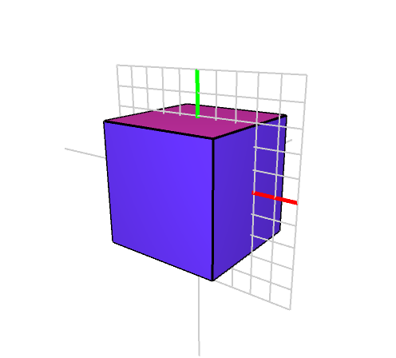 | 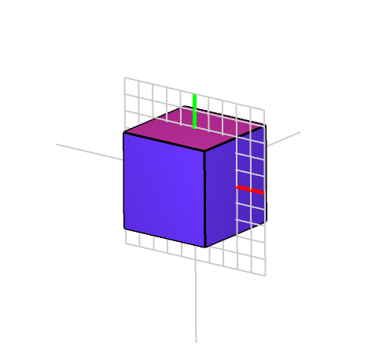 |

<video src="media/Orbiter_freefly_showcase.mp4" controls width="600">Camera showcase: Orbiter & Free-fly</video>

Additional camera features include:
- **Constrained rotation** — lock rotation around the right, up, or forward axis
- **Align-to-nearest-axis** — double-click to snap the camera to the closest world axis
- **Zoom**, FOV adjustment, and configurable smoothing

<video src="media/Basic_viewer_glfw_constraint_axis_showcase.mp4" controls width="600">Constrained Rotation showcase</video>

<video src="media/Basic_viewer_glfw_align_camera_showcase.mp4" controls width="600">Align to Nearest Axis showcase</video>

---

## Clipping Plane

An interactive infinite clipping plane slices the scene in real time. The plane can be rotated, translated, and moved along its own normal or the camera's forward direction. Four display modes expose the interior of solid geometry:

- **Solid only** — opaque cut, geometry beyond the plane is discarded
- **Solid / transparent** — see-through back faces on the clipped half
- **Solid / wireframe** — wireframe rendering on the clipped half
- **Full draw** — both halves rendered normally

The camera can also be orthogonally aligned to the clipping plane for precise cross-section views.

<video src="media/Basic_viewer_glfw_clipping_plane_showcase.mp4" controls width="600">Clipping Plane showcase</video>

<video src="media/Basic_viewer_glfw_align_to_clipping_plane_showcase.mp4" controls width="600">Align to Clipping Plane showcase</video>

---

## Rendering Modes

### Geometry Shaders

Edges can be rendered as **cylinders** and vertices as **spheres** via geometry shaders, giving a much cleaner look than raw line/point primitives. This feature was also ported to the Qt viewer.

| Draw all | Solid / transparent | Solid / wireframe | Solid only |
|---|---|---|---|
| 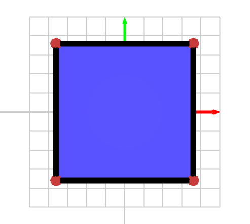 | 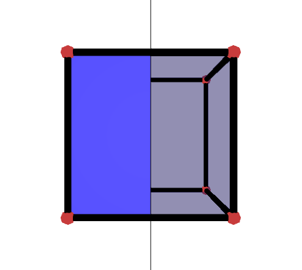 | 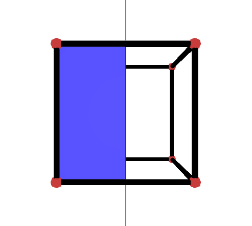 | 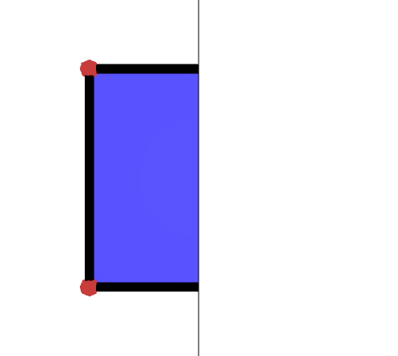 |

| With clipping + cylinder/sphere | Combined with normals |
|---|---|
| 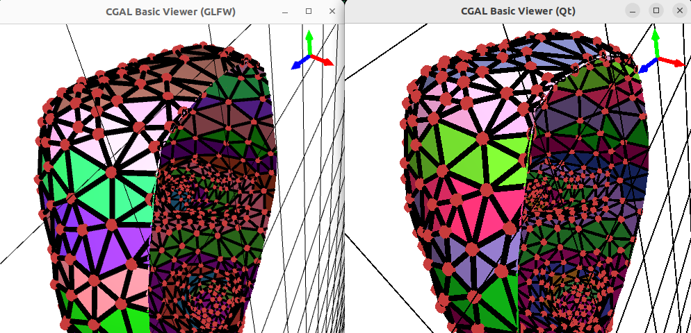 | 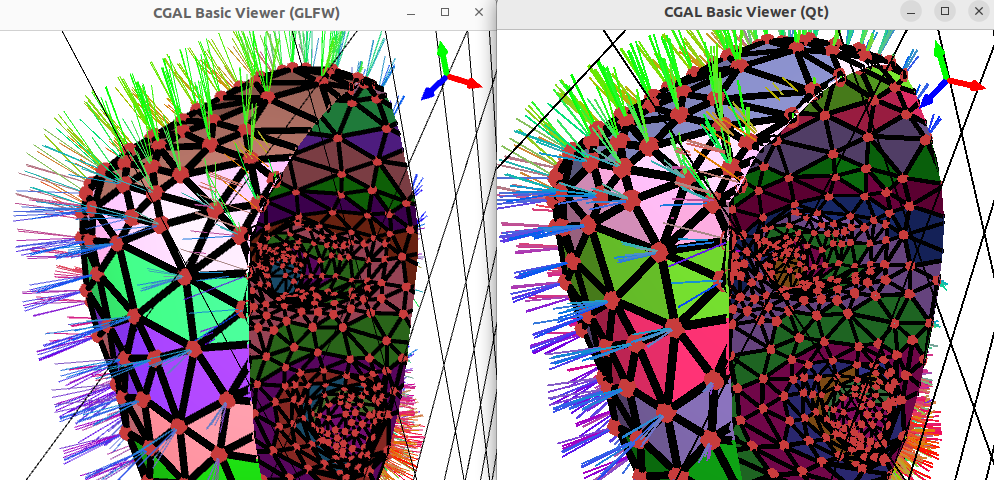 |

### Normal Visualization

Vertex normals can be displayed in mono-color or direction-coded coloring, for both flat and smooth shading. Normals are properly clipped by the clipping plane.

| Mono-color | Direction-colored | Inverted | Flat shading | Smooth shading |
|---|---|---|---|---|
| 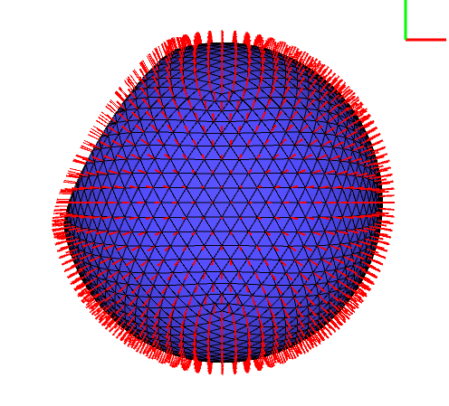 | 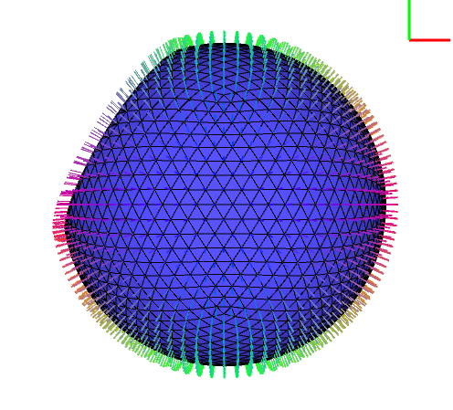 | 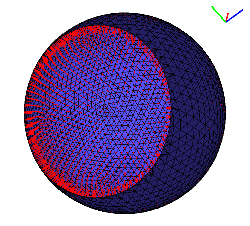 | 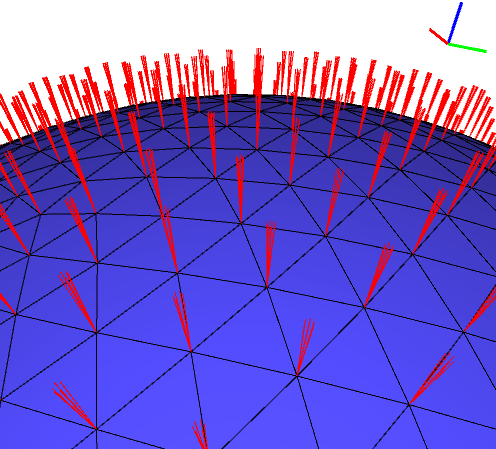 | 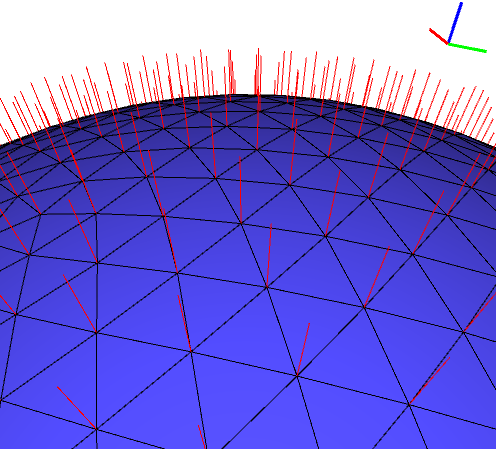 |

| Clipped normals #1 | Clipped normals #2 |
|---|---|
| 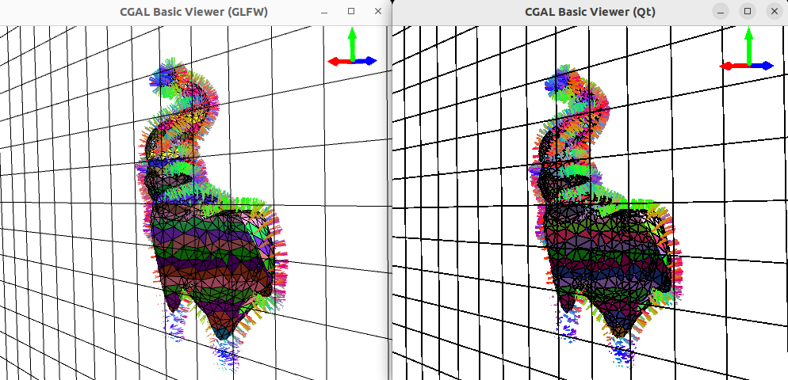 | 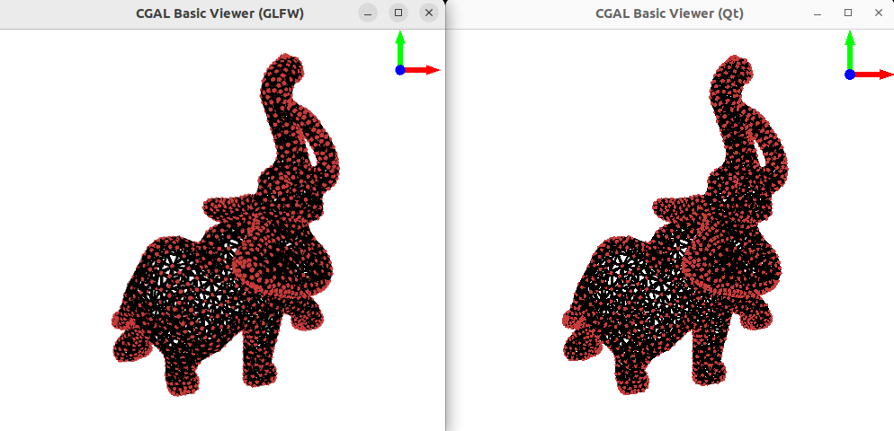 |

### World Axis & Grid

A 3D world axis gizmo (drawn with geometry-shader cylinders and cones) and an XY grid provide spatial orientation feedback.

| World axis | World axis with normals |
|---|---|
| 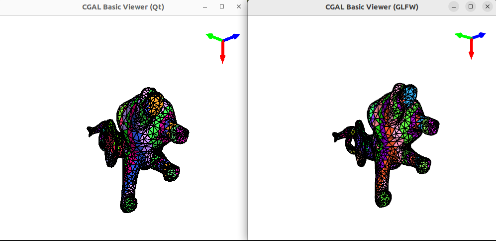 | 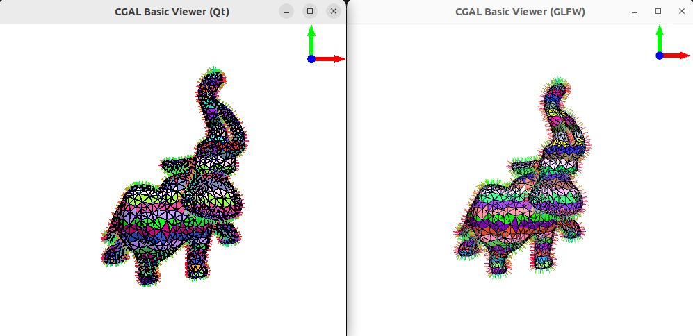 |

<video src="media/WorldAxis_showcase.mp4" controls width="600">World Axis showcase</video>

---

## Keyframe Animation

Record camera poses as keyframes (**`Alt+F1`**) and play back smooth cinematic flythroughs (**`F1`**). Each keyframe stores a quaternion (orientation) and a 3D vector (position). Playback uses SLERP for rotation and linear interpolation for translation, over a configurable duration.

<video src="media/Basic_viewer_glfw_animation_showcase.mp4" controls width="600">Animation showcase</video>

---

## Programmatic API

The viewer exposes setters for scripted camera and clipping plane control — useful for headless screenshot generation without opening a window.

```cpp
CGAL::Graphics_scene buffer;
add_to_graphics_scene(sm, buffer, Colored_faces_given_height(sm));
CGAL::Basic_viewer bv(&buffer, "Basic viewer");

using DisplayMode = CGAL::GLFW::Basic_viewer::DisplayMode;

bv.camera_orientation({0, 0, 1}, 180);
bv.display_mode(DisplayMode::CLIPPING_PLANE_SOLID_HALF_WIRE_HALF);
bv.clipping_plane_orientation({-1, 0, 0});
bv.clipping_plane_translate_along_normal(5);
bv.make_screenshot("./screenshot.png");
```

| Default view | Result of the snippet above |
|---|---|
| 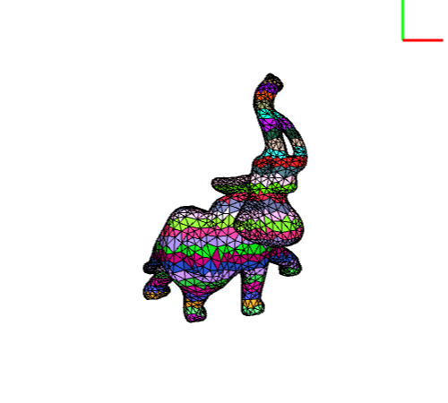 | 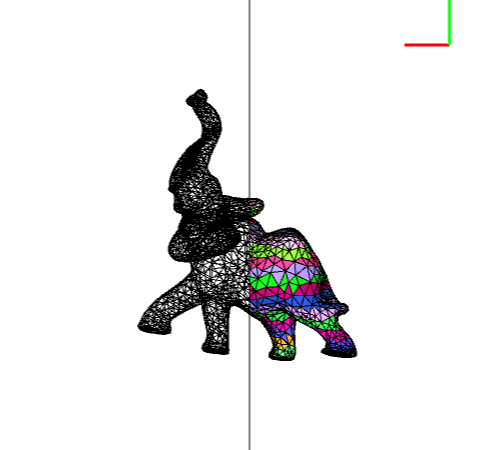 |

<details>
<summary><strong>Full setter reference</strong></summary>

```cpp
scene_radius(float radius)                              // Scene bounding radius
scene_center(const vec3f& center)                       // Scene center (orbiter pivot)
camera_position(const vec3f& position)                  // Camera position
camera_orientation(const vec3f& forward, float upAngle) // Camera orientation (forward dir + up angle in degrees)
zoom(float zoom)                                        // Camera zoom
align_camera_to_clipping_plane()                        // Snap camera perpendicular to clipping plane
clipping_plane_orientation(const vec3f& normal)         // Clipping plane normal
clipping_plane_translate_along_normal(float t)          // Translate plane along its normal
clipping_plane_translate_along_camera_forward(float t)  // Translate plane along camera forward
display_mode(DisplayMode mode)                          // Clipping plane display mode
draw_clipping_plane(bool b)                             // Enable/disable clipping plane
```

</details>

---

## Build System & Cross-Platform Support

A dedicated `GLFW` CMake component (mirroring the existing `Qt6` component) handles dependency detection and compilation of GLFW and GLAD across **Windows**, **macOS**, and **Linux** (X11 and Wayland). The viewer links against `CGAL::CGAL_Basic_viewer_GLFW`. If both components are declared, Qt takes precedence.

QWERTY and AZERTY keyboard layouts are supported. A built-in shortcut help is printed to the console on launch.


---

## Keyboard Reference

| Key | Action |
|-----|--------|
| **`O`** | Toggle perspective / orthographic |
| **`LCtrl+V`** | Toggle orbiter / free-fly |
| **`Left Mouse`** | Rotate |
| **`Right Mouse`** | Translate |
| **`Scroll`** | Zoom |
| **`Ctrl+Scroll`** | Adjust FOV |
| **`LShift+Up/Down`** | Move forward / backward |
| **`LCtrl+R`** | Reset camera |
| **`A`** | Toggle world axis |
| **`G`** | Toggle XY grid |
| **`LCtrl+Left Mouse`** | Rotate clipping plane |
| **`LCtrl+Right Mouse`** | Translate clipping plane |
| **`LCtrl+Mouse Wheel`** | Move clipping plane along camera forward |
| **`Alt+F1`** | Save animation keyframe |
| **`F1`** | Play animation |
